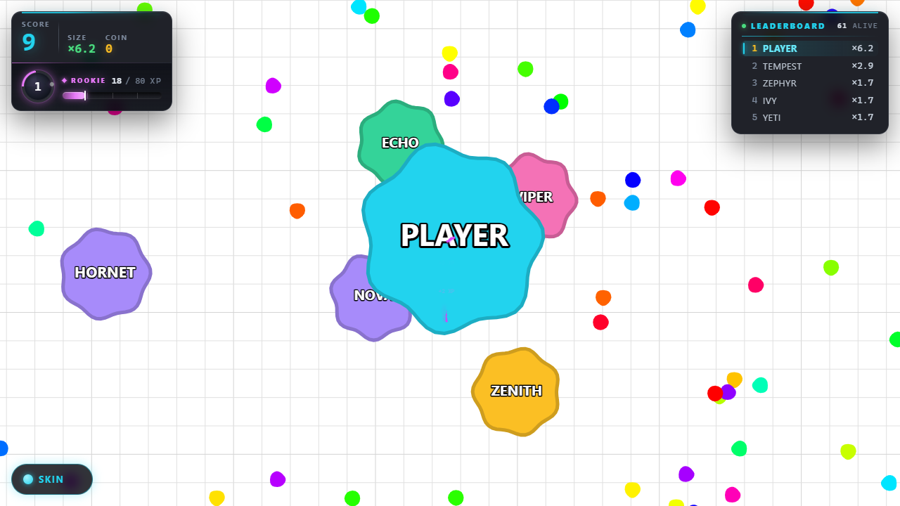
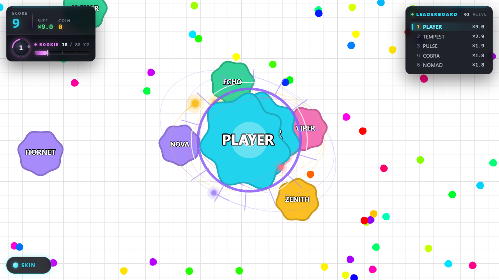

# NEON ARENA .IO

> **agar.io tarzında** — hareket, büyüme, yutma ve harita ölçeği klasik
> formüllere sadıktır; üzerine derinlik ekonomisi (coin / XP / rank), 15 skin,
> 5 slotlu efekt marketi ve premium HUD eklendi. Tarayıcıda çalışır, sunucu
> yoktur, hesap yoktur.



<sub>Skor okuması + rank ünitesi (sol), canlı sıralama (sağ), 60 bot, 6 000 yem,
20 000×20 000 px harita.</sub>

---

## Efektler



<sub>Bölünme anı: mor sonic halkası + 14 radyal enerji çizgisi, hücreyi saran üç
elips yörüngede gezegenler (amber / mor / gül).</sub>

**5 slot, 8 efekt** — aynı anda beşi birden kuşanılabilir:

| Slot | Efektler |
|---|---|
| **İZ** | Neon İz · Yıldız İzi · Rün İzi · **Galaktik İz** |
| **YUTMA** | Şok Dalgası |
| **BÖLÜNME** | Sonic Boom |
| **AURA** | Yörünge |
| **ATIŞ** | Alev Topu |

Efektler iki katmanlıdır: **imza** katmanı (bölünme/yutma halkaları, radyal
çizgiler) 16 sabit slotlu ayrı bir sistemdir ve parçacık havuzundan
**bağımsız** çalışır — yem fırtınasında havuz 240/240 doluyken bile okunur.
**Doku** katmanı (kırıntı, köz, alev izi) oyunun ortak parçacık havuzunu
kullanır. Aura ise hiç parçacık üretmez, saf çizimdir.

---

## Kurulum

```bash
git clone <repo-url>
cd neon-arena-io
npm install
npm run dev          # http://localhost:5173
```

| Komut | Ne yapar |
|---|---|
| `npm run dev` | Vite geliştirme sunucusu |
| `npm run build` | `tsc --noEmit` + üretim derlemesi |
| `npm run typecheck` | Yalnızca tip kontrolü |
| `npm run test:visual` | 108 kontrollük görsel-işlevsel test suite |

**Test suite'i çalıştırmak için iki şey gerekir:**

```bash
npx playwright install chromium   # tarayıcı paketi (paket indirilmezse hata verir)
npm run dev                      # AYRI bir terminalde açık kalmalı
npm run test:visual
```

Playwright tarayıcılarını indirmek istemiyorsanız sistem Chrome'u hedefleyebilirsiniz:
`test/visual-test.mjs` içindeki `chromium.launch()` çağrısını
`chromium.launch({ channel: 'chrome' })` yapın.

## Kontroller

| Girdi | Etki |
|---|---|
| **Fare** | Hücreyi imlece sürükle |
| **Space** | Bölünme (16 parçaya kadar) |
| **W** | Kütle fırlatma |
| **K** | Skin / efekt marketi |
| **F** | Tam ekran |
| **F3** | Virüs teşhis overlay'i |

---

## Öne çıkanlar

- **Oyun mantığı referansa sadık** — kütle doğrusal artar, yarıçap
  `100×√(mass/100)` ile büyür, yutma kuralı ×1.15, yem çekilişi 150 ms
- **React'ten bağımsız 60 fps döngü** — oyun `requestAnimationFrame` ile ilerler,
  HUD veriyi kendi zamanında çeker; React asla kare başına render edilmez
- **Sıfır GC parçacık havuzu** — 240 slot constructor'da bir kez üretilir,
  çalışma sırasında hiç nesne yaratılmaz
- **Tek kaynak tema** — tüm renk/boyut/animasyon sayıları
  `src/theme/visualTheme.ts` içinde; UI'da hardcoded değer yok
- **Katman mimarisi** — `logic/` asla `render/` importu yapmaz; oyun kuralları
  çizimden tamamen bağımsızdır
- **Ölçülebilir görsellik** — 108 kontrollük suite ekran görüntüsünü PNG'ye
  çözüp piksel sayar; "var" değil **"görünüyor"** der
- **15 skin + 8 efekt + coin/XP/rank ekonomisi** — hepsi `localStorage`'da

---

## Dokümantasyon

📖 **[progress.md](progress.md)** — oyunun tamamı: mimari, tema sistemi, hücre
fiziği, bot yapay zekâsı, virüs mekaniği, efekt marketi, ekonomi, HUD, test
sistemi ve dosya haritası.

## Proje yapısı

```
src/
├── game/Game.ts        Ana döngü, olay tüketimi, test kancaları
├── logic/              Oyun kuralları (saf — render importu YASAK)
├── render/             Canvas çizimi (sadece okur)
│   └── fx/             Efekt katmanı (imza / doku / çizim)
├── ui/                 React HUD ve menüler
├── skins/              Skin + efekt katalogları, market
├── progression/        XP eğrisi
├── input/              İmleç → dünya hedefi
└── theme/              Görsel kimliğin tek kaynağı
```

## Notlar

- **Sunucu yoktur ve ağ isteği yapmaz.** Kodda `fetch` / `WebSocket` yok;
  ilerleme verisi yalnızca tarayıcının `localStorage` alanında durur. Oyun
  tek başına, tamamen çevrimdışı çalışır.
- **Hesap yoktur.** Tüm ilerleme tarayıcıda `localStorage`'da tutulur.
- **Çok oyunculu değildir.** 60 bot, oyuncuyla **aynı** fizik motorundan geçer.
  Botlar ve oyuncu için ayrı kod yolu yoktur — hepsi aynı `updatePlayer`,
  `Growth`, `Devour` fonksiyonlarından geçer.
- **Skin sprite'ları** `public/skins/` altındadır (~28 MB, 14 PNG). Üretim
  betiği `tools/gen-skins.py`, prompt'ları `tools/SKIN_PROMPTS.md`.
- **Testler** Playwright + sistem Chrome kullanır. Dev sunucusu açık olmalıdır;
  tarayıcı paketi indirilmemişse `chromium.launch({ channel: 'chrome' })`.

---

## Dağıtım

**Vercel** için ek yapılandırma gerekmez — Vite algılanır. Depoda hazır bir
`vercel.json` vardır: derleme komutu, çıktı dizini, önbellek başlıkları ve
güvenlik başlıkları (aşağıda).

```bash
npm i -g vercel
vercel          # önizleme
vercel --prod   # yayın
```

`framework` ve `outputDirectory` açıkça yazılmıştır — tanımlı olmasalar da
Vercel otomatik algılar, ama yazılı olması belirsizliği bitiriyor.
Oyun tamamen statiktir: sunucu fonksiyonu, veritabanı veya build adımı gerekmez.
`.vercelignore` ile `test/` ve `tools/` dağıtımdan da çıkarılabilir.

**Netlify / GitHub Pages** için: `npm run build` → `dist/` klasörünü yayınlayın.
Tek sayfalı uygulama olduğu için yönlendirme (rewrite) kuralı gerekmez.

### Güvenlik durumu

| Konu | Durum |
|---|---|
| Bağımlılık açıkları (`npm audit`) | **0** — çalışma zamanında yalnızca React |
| Üçüncü taraf istek / SDK / analytics | **Yok** — CDN, font, ölçüm yok; çalışma tamamen aynı kökende |
| Gömülü anahtar / parola | **Yok** — `GEMINI_API_KEY` ortamdan okunuyor |
| Tehlikeli DOM API (`innerHTML`, `eval`, `dangerouslySetInnerHTML`) | **Yok** |
| Kişisel dosya yolu / mutlak yol | **Yok** |
| Content-Security-Policy | `vercel.json` içinde **etkin** (üretim derlemesiyle doğrulandı) |
| Diğer başlıklar | `nosniff`, `X-Frame-Options: DENY`, `Referrer-Policy`, `Permissions-Policy`, HSTS |
| Test kancaları (`window.test_*`) | **Üretimde kapalı** — yalnızca `DEV` modunda veya `VITE_TEST_HOOKS=1` ile açılır |

CSP katısıdır (`default-src 'self'`, `object-src 'none'`,
`frame-ancestors 'none'`). Başlıklar yayınlanmadan önce `dist/` üzerinde
doğrulanmıştır: oyun açılıyor, skinler yükleniyor, konsol temiz.

---

## Lisans

**Kod: MIT** · **Görseller (skin sprite'ları): CC BY-NC-SA 4.0**

Ayrı lisanslar bilinçli bir tercihtir: kod liberal olmalı (topluluk katkısı
gelsin), görseller ise ticari yeniden dağıtıma kapalı kalsın.

MIT ne verir: herkes kodu kullanabilir, değiştirebilir, ticari amaçla
dağıtabilir — tek şart telif bildirimini korumak. Katkı gelmesini ve
projeyi çatallanmasını istiyorsanız doğru seçim budur.

Görseller için CC BY-NC-SA: sprite'lar yapay zekâ aracıyla üretildi. Üretimde
kullandığınız aracın kullanım koşulları kendi arzınızı kısıtlamış olabilir —
**üretimde kullandığınız aracın şartlarını kontrol edin**; NC (ticari olmayan)
koşulu bu belirsizliğe karşı bir güvence. NC koşulunu istemiyorsanız CC BY 4.0
(NC'siz) da uygundur.

Kopyalayan (copyleft) lisans isterseniz: **GPL-3.0** türevlerin de açık
kalmasını zorunlu kılar, **AGPL-3.0** bunu ağ üzerinden kullanıma da
yayar. Bu tür bir tarayıcı oyunu için genelde ağır kalır ve kurumsal katkıyı
engeller.

Lisans dosyaları depoda:

| Dosya | Kapsam | Lisans |
|---|---|---|
| [`LICENSE`](LICENSE) | `src/**` kaynak kodu | **MIT** |
| [`LICENSE-ASSETS`](LICENSE-ASSETS) | `public/skins/*.png`, `docs/*.png`, `tools/SKIN_PROMPTS.md` | **CC BY-NC-SA 4.0** |

### agar.io hakkında

Bu proje agar.io'nun **oynanış kurallarını** (hareket, büyüme, yutma oranı,
harita ölçeği) referans alır; kod, görsel ve marka **tamamen özgündür**. Referans
klon kodu bu depoda **yoktur**.

Bununla birlikte: bir ".io" oyunu olarak agar.io'ya benzerliği ilk bakışta
fark edilir. "birebir" gibi ifadeler yerine **"agar.io tarzında"** demek, isim
ve oyun markasına ilişkin iddiaları (marka hakkı / ticari görünüm) gereksiz
yere tartışmaya açmaz. README'nin bu yönü değiştirilmesi önerilir.
